# Estratégia de Expansão – Case ZCTAs

**Estudo baseado em dados econômicos, demográficos e transacionais**  
*Ezequiel Schneider*  
*Abril de 2025*

---

## Índice

- [Estratégia de Expansão – Case ZCTAs](#estratégia-de-expansão--case-zctas)
  - [Índice](#índice)
  - [1. Plano Estruturado para Análise](#1-plano-estruturado-para-análise)
      - [Entendimento da Dor e Lógica de Negócio](#entendimento-da-dor-e-lógica-de-negócio)
      - [Formulação do Problema](#formulação-do-problema)
      - [Revisão de Descobertas Anteriores](#revisão-de-descobertas-anteriores)
      - [Planejamento](#planejamento)
      - [Sanity Check dos Dados](#sanity-check-dos-dados)
      - [Definição de Premissas](#definição-de-premissas)
      - [Alinhamento de Hipóteses](#alinhamento-de-hipóteses)
      - [Entendimento Geral dos Dados](#entendimento-geral-dos-dados)
      - [Análise Guiada pelas Hipóteses](#análise-guiada-pelas-hipóteses)
      - [Sumarização dos Resultados](#sumarização-dos-resultados)
      - [Criação de Script Python](#criação-de-script-python)
      - [Apresentação Clara e Objetiva](#apresentação-clara-e-objetiva)
  - [2. Lógica de Negócio e Árvore de Problemas](#2-lógica-de-negócio-e-árvore-de-problemas)
      - [Pesquisa e Revisão de Descobertas Anteriores](#pesquisa-e-revisão-de-descobertas-anteriores)
      - [Árvore de Problemas](#árvore-de-problemas)
      - [Hipóteses para Validação](#hipóteses-para-validação)
      - [Diagrama de Entidades](#diagrama-de-entidades)
  - [3 – Hipóteses Validadas](#3--hipóteses-validadas)
      - [H1 – Potencial Econômico e Demográfico](#h1--potencial-econômico-e-demográfico)
      - [H2 – Performance Atual de Exames](#h2--performance-atual-de-exames)
      - [H3 – Concorrência e Saturação de Mercado](#h3--concorrência-e-saturação-de-mercado)
      - [H4 – Logística e Acessibilidade](#h4--logística-e-acessibilidade)
      - [H5 – Aspectos Estratégicos e de Fidelização](#h5--aspectos-estratégicos-e-de-fidelização)
  - [4 – Escolha dos ZCTAs](#4--escolha-dos-zctas)
  - [5 – Conclusões Gerais](#5--conclusões-gerais)
  - [6 – Próximos Passos / Sugestões](#6--próximos-passos--sugestões)
  - [7 – Obrigado!](#7--obrigado)

---

## 1. Plano Estruturado para Análise

#### Entendimento da Dor e Lógica de Negócio
- O desafio central é identificar oportunidades estratégicas para expansão da rede laboratorial com foco em fidelização dos clientes, dado que gerar demanda nova é difícil.
- Entender a relevância do mercado de medicina diagnóstica, que é amplo e competitivo nos EUA.

#### Formulação do Problema
- **Objetivo:** Recomendar três áreas (ZCTAs) para instalação de novos laboratórios com base em potencial econômico, demográfico e de mercado (volume de exames e performance financeira).

#### Revisão de Descobertas Anteriores
- Pesquisa breve sobre fatores que tradicionalmente influenciam expansão e fidelização em serviços de saúde.
- Identificar benchmarks ou estudos similares anteriores relacionados ao mercado diagnóstico nos EUA.

#### Planejamento
- Definir quais dados serão necessários para atingir os objetivos.
- Estabelecer etapas e estratégias para validação e tratamento de dados.
- Decidir quais técnicas analíticas serão usadas.

#### Sanity Check dos Dados
- Analisar e validar formatos, tipos, valores ausentes e inconsistências (dados econômicos, demográficos, financeiros, e volumes de exames).
- Resumir problemas encontrados em uma tabela ou relatório claro.

#### Definição de Premissas
- Clientes fidelizados aumentam rentabilidade da rede.
- Características demográficas e econômicas têm forte relação com performance financeira dos laboratórios.
- Volumes históricos de exames refletem oportunidades futuras.

#### Alinhamento de Hipóteses
- Validar hipóteses relacionadas ao comportamento dos clientes (idade, frequência, recorrência).
- Explorar dados de desempenho financeiro e volume de exames relacionados a variáveis demográficas e econômicas.

#### Entendimento Geral dos Dados
- Realizar análise estatística descritiva (distribuições, correlações).
- Visualizar os dados por ZCTA para identificar padrões geográficos.

#### Análise Guiada pelas Hipóteses
- Relacionar variáveis demográficas e econômicas com dados financeiros e volumes de exames.
- Analisar segmentação clara por perfil regional e econômico.

#### Sumarização dos Resultados
- Preparar resumo claro e objetivo dos insights encontrados.
- Identificar claramente os padrões que suportem a recomendação das três ZCTAs escolhidas.

#### Criação de Script Python
- Construir código modular e documentado para automatizar as análises.
- Garantir que novos dados possam ser rapidamente incorporados e analisados sem esforço adicional significativo.

#### Apresentação Clara e Objetiva
- Expor claramente metodologia, justificativa para escolha das ZCTAs e suas limitações.
- Propor ações concretas para implementação da expansão com base na análise.
- Destacar claramente insights e decisões orientadas a dados.

---

## 2. Lógica de Negócio e Árvore de Problemas
Neste capítulo será aprofundado o entendimento sobre a lógica de negócios do mercado diagnóstico e o contexto de expansão e fidelização.

#### Pesquisa e Revisão de Descobertas Anteriores
- **Crescimento do Mercado de Diagnóstico por Imagem:** Estima-se que o mercado de diagnóstico por imagem nos EUA registre um crescimento anual composto (CAGR) de aproximadamente 6,0% durante o período de previsão. Esse crescimento é impulsionado por avanços tecnológicos e pelo aumento da conscientização sobre cuidados preventivos.
- **Tendências em Diagnósticos Clínicos:** O mercado de diagnósticos clínicos nos EUA está projetado para atingir US$ 84,18 bilhões em 2024, com um crescimento contínuo impulsionado pela demanda por diagnósticos precisos e rápidos.
Fonte: [Mordor Intelligence](https://www.mordorintelligence.com/pt/industry-reports/clinical-diagnostic-market)

#### Árvore de Problemas

**Problema Principal:** Escolha das melhores 3 ZCTAs para expansão dos laboratórios  
│  
├── **Potencial Econômico/Demográfico**
│   ├── Alta densidade populacional  
│   ├── População com perfil etário propenso a exames frequentes (idosos, portadores de doenças crônicas)  
│   └── Alto poder aquisitivo da população  
│  
├── **Performance e Demanda Atual de Exames**
│   ├── Histórico elevado no volume de exames diagnósticos na região  
│   ├── Forte tendência de crescimento na procura por exames laboratoriais  
│   └── Região subatendida (baixa concorrência local, mas alta demanda percebida)  
│  
├── **Concorrência Local**
│   ├── Baixa concorrência direta de outros laboratórios  
│   └── Pouca fidelização de clientes em relação aos concorrentes atuais (oportunidade de entrada)  
│  
├── **Logística e Acessibilidade**
│   ├── Fácil acesso físico à região (vias rápidas, transporte público, estacionamento disponível)  
│   └── Facilidade logística para transporte de materiais biológicos e resultados  
│  
└── **Aspectos Estratégicos**
    ├── Oportunidades de parceria com médicos e clínicas locais  
    ├── Possibilidade de fidelização rápida dos clientes (estratégias digitais e CRM)  
    └── Região estratégica para presença e reconhecimento da marca

#### Hipóteses para Validação
Baseado na árvore de problemas levantada, essas são as hipóteses para serem validadas.

**H1 – Potencial Econômico e Demográfico**
- **H1a:** ZCTAs com maior densidade populacional têm maior volume de exames realizados

- **H1b:** ZCTAs com maior renda média têm maior gasto médio por paciente

- **H1c:** ZCTAs com maior proporção de população idosa (acima de 65 anos) têm maior frequência de utilização dos serviços laboratoriais

- **H1d:** ZCTAs com maior proporção de mulheres têm maior frequência de utilização dos serviços laboratoriais

**H2 – Performance Atual de Exames**
- **H2a:** ZCTAs com maior número de exames realizados nos últimos anos indicam maior potencial futuro.

- **H2b:** Exames com maior custo operacional têm relação direta com receita e lucro mais altos para a rede.

- **H2c:** *(Consequencia da exporação dos dados)* ZCTAs com alta proporção de mulheres podem ser estratégicos para expansão, especialmente considerando que os exames mais rentáveis da rede são voltados à saúde feminina.

**H3 – Concorrência e Saturação de Mercado**
- **H3a:** ZCTAs com menos laboratórios concorrentes têm maior potencial para expansão da rede.

- **H3b:** ZCTAs com alto volume de exames realizados em relação à quantidade de laboratórios existentes representam uma oportunidade estratégica de expansão.

> Obs: Hipóteses que poderiam ser consideradas prém avaliando os dados presentes, não foi possível tirar conclusões

**H4 – Logística e Acessibilidade**
- **H4a:** Laboratórios localizados em ZCTAs com melhores índices de acessibilidade (ex.: proximidade de vias principais, transporte público) possuem maior volume médio de exames realizados.

- **H4b:** ZCTAs com maior concentração urbana têm maior potencial de fidelização devido à facilidade logística para clientes.

> Obs: Mesmo caso das hipóteses em H3

**H5 – Aspectos Estratégicos e de Fidelização**
- **H5a:** ZCTAs que apresentam maior diversidade de exames realizados demonstram maior fidelização dos pacientes.

- **H5b:** Pacientes em ZCTAs com maior recorrência anual de exames indicam maior fidelização e retorno financeiro previsível.

**Metodologia para validação das hipóteses:**
- Análise exploratória com visualizações.

- Análise estatística descritiva e inferencial para validar diferenças significativas entre grupos.

- Aplicação de modelos preditivos simples para relacionar variáveis demográficas/econômicas com volume e receita gerada.

#### Diagrama de Entidades

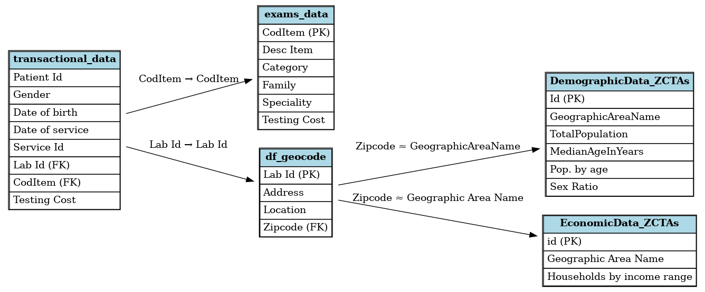

- `transactional_data.csv` – Histórico de exames por paciente e laboratório.
- `exams_data.csv` – Especificações e custos dos exames.
- `df_geocode.csv` – Localização dos laboratórios.
- `DemographicData_ZCTAs.csv` – Dados demográficos por ZCTA.
- `EconomicData_ZCTAs.csv` – Dados econômicos por ZCTA.

---

## 3 – Hipóteses Validadas

Baseado na árvore de problemas levantada, essas são as hipóteses avaliadas com base nos dados disponíveis.

---

#### H1 – Potencial Econômico e Demográfico

**H1a: ZCTAs com maior densidade populacional têm maior volume de exames realizados**

  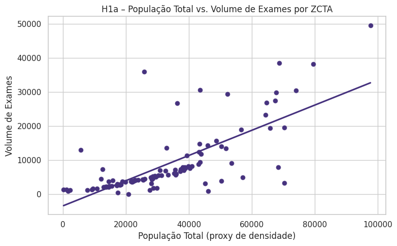

- **Suportada.**
- Correlação de **0.73** entre população total e volume de exames.
- Gráfico mostra clara tendência positiva.
- População total se mostra um excelente proxy de densidade.

**H1b: ZCTAs com maior renda média têm maior gasto médio por paciente**

  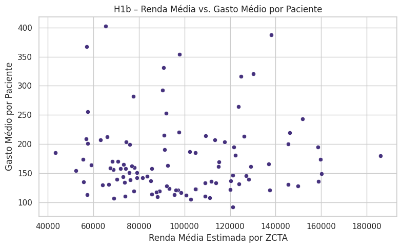

- **Não suportada.**
- Nenhuma correlação relevante encontrada.
- Gráfico mostra dispersão considerável sem padrão claro.

**H1c: ZCTAs com maior proporção de população idosa (65+) têm maior uso dos serviços laboratoriais**

  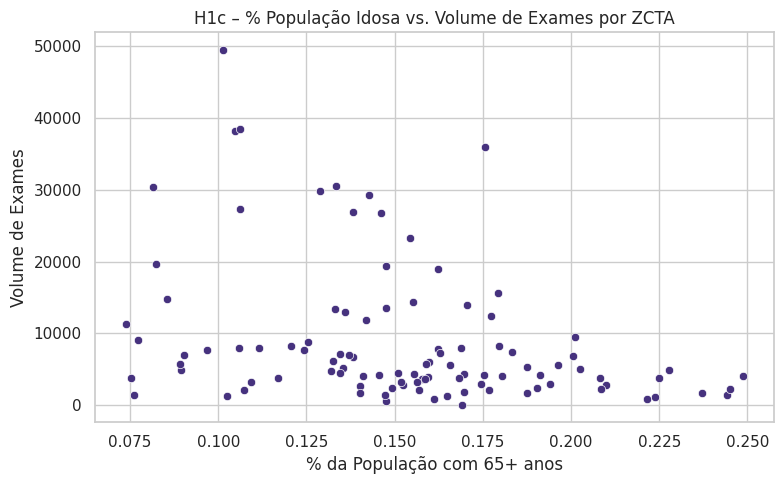
  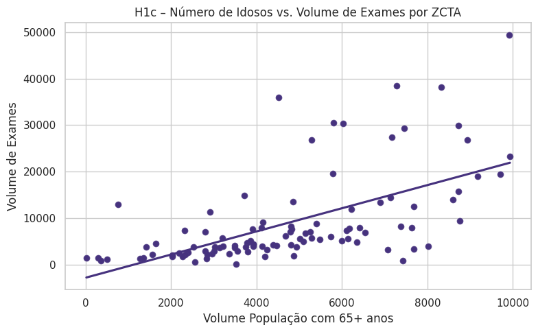

- **Parcialmente suportada.**
- Correlação com número absoluto de idosos foi **0.60**, mas perdeu significância em regressão múltipla quando ajustado por população total.
- População total é melhor preditor do volume.

**H1d: ZCTAs com maior proporção de mulheres têm maior uso dos serviços laboratoriais**

  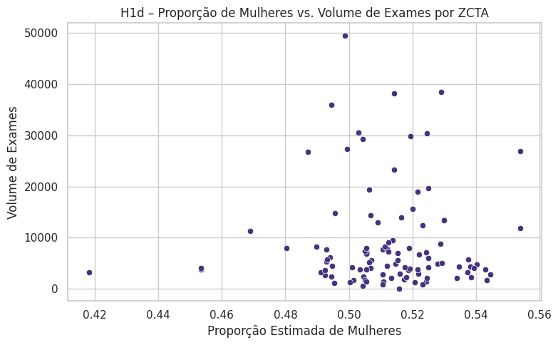

- **Não suportada.**
- Correlação próxima de zero.
- Dados não indicam maior volume de exames em regiões com mais mulheres.

---

#### H2 – Performance Atual de Exames

**H2a: ZCTAs com maior número de exames realizados nos últimos anos indicam maior potencial futuro**

  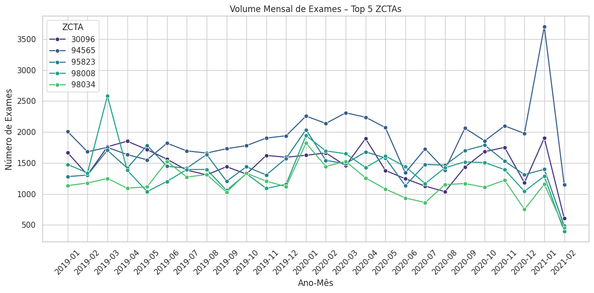
  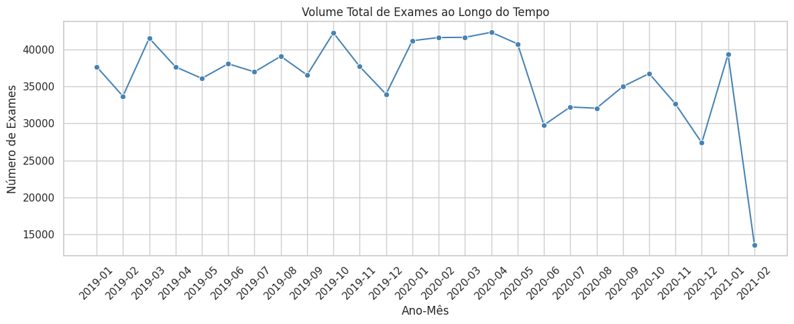

  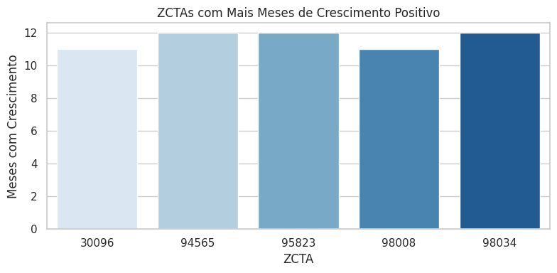

- **Suportada.**
- ZCTAs como `94565`, `95823` e `30096` mantêm volumes elevados e consistentes ao longo do tempo.
- Gráficos temporais indicam estabilidade e retomada pós-pandemia.

**H2b: Exames com maior custo operacional têm relação direta com receita e lucro mais altos para a rede**

  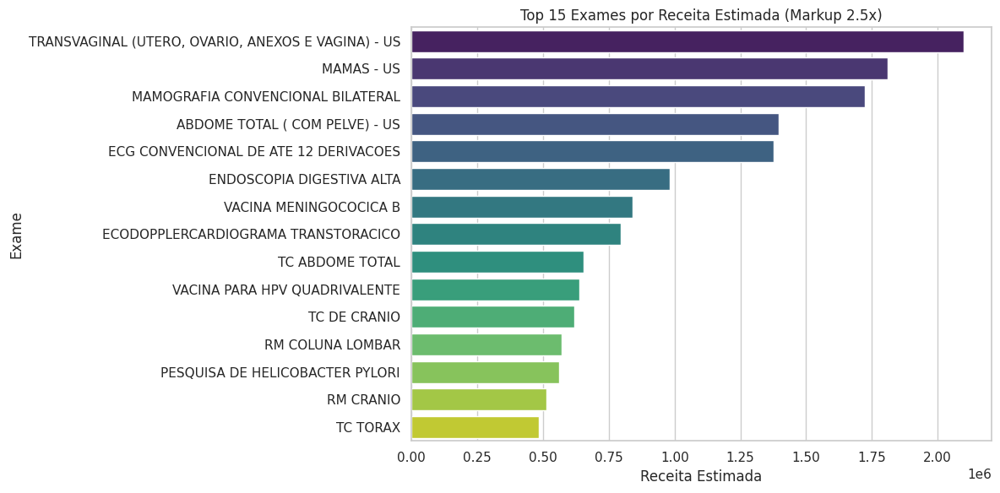

- **Suportada com simulação.**
- Utilizando markup de 2.5x, observou-se que exames que lideram em receita estimada combinam a Alta demanda e custo moderado a alto.
- Exames femininos dominam o ranking de rentabilidade.

**H2c: ZCTAs com alta proporção de mulheres podem ser estratégicos para expansão, dado o potencial dos exames mais rentáveis**
- **Suportada como insight emergente.**
- Apesar de não haver correlação direta com volume total, ZCTAs com público majoritariamente feminino concentram a aplicação de exames rentáveis.
- Pode representar **potencial estratégico não evidente**.
- Não foram identificados ZCTAs com predominância feminina e volume elevado de exames que estejam completamente descobertos pela rede (ou seja, **sem laboratório**).

---

#### H3 – Concorrência e Saturação de Mercado

**H3a: ZCTAs com menos laboratórios concorrentes têm maior potencial para expansão da rede**
- **Não avaliada.**
- Faltam dados sobre concorrência de outras redes.

**H3b: ZCTAs com alto volume de exames em relação à quantidade de laboratórios são oportunidades estratégicas**
- **Não avaliada.**
- Apesar de termos os dados de localização da rede, não há dados completos de concorrentes.

> **Obs:** Hipóteses plausíveis, mas não foi possível tirar conclusões com os dados disponíveis.

---

#### H4 – Logística e Acessibilidade

**H4a: ZCTAs com melhores índices de acessibilidade possuem maior volume médio de exames**
- **Não avaliada.**
- Faltam dados de infraestrutura urbana, transporte público ou vias.

**H4b: ZCTAs com maior concentração urbana têm maior potencial de fidelização**
- **Não avaliada.**
- Hipótese interessante, mas inviável com os dados atuais.

> **Obs:** Mesmo caso das hipóteses H3 — relevantes, mas requerem dados complementares.

---

#### H5 – Aspectos Estratégicos e de Fidelização

**H5a: ZCTAs com maior diversidade de exames demonstram maior fidelização dos pacientes**

  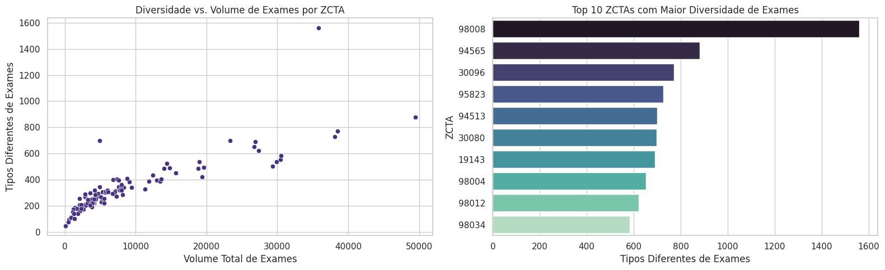

- **Suportada.**
- Diversidade está altamente correlacionada ao volume total.
- ZCTAs com alta diversidade também concentram exames estratégicos.

**H5b: Pacientes em ZCTAs com maior recorrência anual de exames indicam maior fidelização e retorno financeiro previsível**

  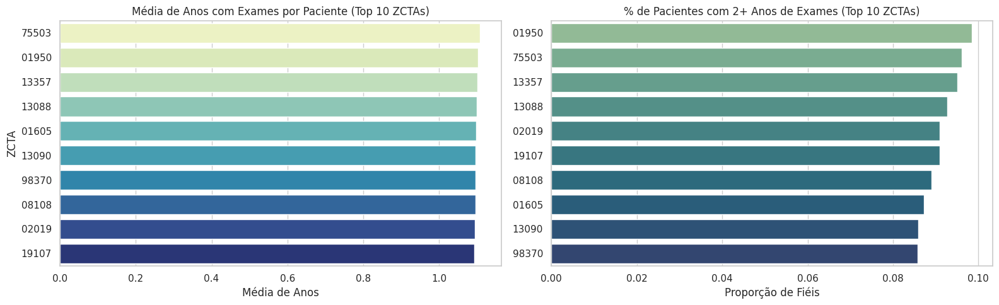

- **Não suportada.**
- Apenas ~10% dos pacientes retornam em anos diferentes.
- ZCTAs com maior fidelização anual (ex: `19107`, `02019`) ainda têm baixa proporção de retorno.

---

## 4 – Escolha dos ZCTAs

- Critérios: Atraves da relevância de cada hipótese levantada, foram consideradas a alta densidade de população e numero de exames, público feminino estratégico e taxa de fidelidade dos clientes.
- Top 3 ZCTAs recomendados:
  - ZCTA 1: **94565 – Pittsburg, CA**
  - ZCTA 2: **30096 – Duluth, GA**
  - ZCTA 3: **19120 – Philadelphia, PA**

| ZCTA   | Total Exames | Tipos de Exames | TotalPopulation | perc_idosos | perc_mulheres | Labs na ZCTA | Meses com Crescimento | Fidelização Média | Fidelização (%) |
|--------|---------------|------------------|------------------|--------------|----------------|----------------|------------------------|--------------------|------------------|
| **94565** | **122840**      | **1035**            | **97671**         | 0.101412     | 0.498753       | 1              | 26                     | 1.033971           | 0.032649         |
| **30096** | **95878**       | 946              | 68691           | 0.106040     | **0.529101**     | 1              | 26                     | 1.018067           | 0.017829         |
| 95823 | **94218**       | 892              | 79440           | 0.104783     | 0.514139       | 1              | 26                     | 1.032526           | 0.030218         |
| 98008 | 89050        | **1702**           | 25719           | **0.175629**   | 0.494560       | 1              | 26                     | 1.026788           | 0.025621         |
| 98034 | 76801        | 720              | 43471           | 0.133445     | 0.503018       | **3**          | 26                     | 1.031647           | 0.029278         |
| **19120** | 76749        | 673              | 74060           | 0.081366     | **0.524659**     | 1              | 26                     | 1.045859           | **0.043821**       |
| 19148 | 73726        | 616              | 52259           | 0.142617     | 0.504286       | 2              | 26                     | **1.049441**         | **0.045940**       |
| 30135 | 73697        | 641              | 67710           | 0.128873     | 0.519481       | 1              | 26                     | 1.026900           | 0.025534         |
| 98012 | 70078        | 762              | 67427           | 0.106233     | 0.499500       | 1              | 26                     | 1.025503           | 0.024228         |
| 19143 | 68968        | 847              | 64630           | 0.138078     | **0.554017**     | 1              | 26                     | 1.035492           | 0.034684         |

---

## 5 – Conclusões Gerais

A escolha das ZCTAs levou em consideração tanto aspectos demográficos quanto operacionais. As regiões selecionadas apresentam uma combinação ideal de:

- Demanda consolidada
- Público-alvo estratégico (mulheres)
- Fidelização dos clientes

Essas regiões devem ser priorizadas em qualquer plano de expansão de curto a médio prazo.

---

## 6 – Próximos Passos / Sugestões

- Análises temporais para detectar sazonalidade.
- Clusterização de regiões por perfil de demanda.
- Modelos de classificação para sugerir ZCTAs sem nenhum laboratório.

---

## 7 – Obrigado!

Dúvidas?
